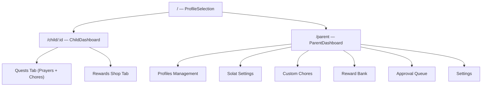

# Dah Solat — Architecture & Codebase Reference

This document provides an overview of the technical architecture, folder structure, and key components of Dah Solat.

## 1. Architectural Philosophy
Dah Solat follows a **Feature-Based (Modular) Architecture**. Related logic, components, and types are grouped by their domain (e.g., Prayers, Rewards, Profiles) rather than technical role. This ensures high cohesion and easy navigation for a small, focused app.

## 2. Folder Structure

```text
src/
├── assets/              # Static assets (images, icons, sounds)
├── components/          # Generic, reusable UI components
│   └── ui/              # Atomic elements (Button, Card, Input, Modal)
├── features/            # Domain-driven modules (Core Business Logic)
│   ├── auth/            # Parent PIN and recovery logic
│   │   └── components/
│   │       └── ParentAuth.tsx
│   ├── chores/          # Custom parent-defined chores (up to 3)
│   │   └── components/
│   │       └── ChoreManager.tsx
│   ├── prayers/         # Prayer quests, quest cards, approval queue
│   │   └── components/
│   │       ├── QuestList.tsx
│   │       ├── SwipeableQuestCard.tsx
│   │       ├── ApprovalQueue.tsx
│   │       └── PrayerConfig.tsx
│   ├── profiles/        # Profile selection and management
│   │   └── components/
│   │       ├── ProfileManager.tsx
│   │       └── ChildHeader.tsx
│   ├── rewards/         # Reward Bank and Reward Shop
│   │   └── components/
│   │       ├── RewardBank.tsx
│   │       └── RewardShop.tsx
│   └── settings/        # System settings and data management
│       └── components/
│           └── SettingsPanel.tsx
├── hooks/               # Global custom React hooks
├── layouts/             # Shared page structural wrappers
│   └── Layout.tsx
├── lib/                 # Third-party configurations
│   └── utils.ts         # Tailwind merge utility (cn)
├── pages/               # Top-level route entry points
│   ├── ProfileSelection.tsx
│   ├── ChildDashboard.tsx
│   └── ParentDashboard.tsx
├── store/               # Global state management (Zustand + IndexedDB)
│   └── useStore.ts
├── types/               # Shared TypeScript interfaces
│   └── index.ts
└── utils/               # Pure utility functions
    └── date.ts          # Date/week utilities for quest refresh
```

## 3. Global State (Zustand)

Application state is managed in `src/store/useStore.ts` using Zustand with persistence middleware (via `idb-keyval` for IndexedDB).

### Core State
| Category | State Fields |
|----------|-------------|
| **Profiles** | `profiles: ChildProfile[]` |
| **Quests** | `quests: Quest[]` (prayers + custom chores) |
| **Custom Chores** | `customChores: CustomChore[]` (max 3) |
| **Prayer Config** | `prayerConfig: PrayerConfig[]` (point values per prayer) |
| **Rewards** | `rewards: Reward[]`, `redemptions: Redemption[]` |
| **System** | `parentPin: string`, `recoveryAnswer: string` |

### Core Actions

#### Profiles
- `addProfile(name, avatar)` — Creates a new child profile.
- `updateProfile(id, data)` — Updates profile name/avatar.
- `deleteProfile(id)` — Removes a child profile and all related data.

#### Quests (Prayers + Chores)
- `refreshQuests(childId)` — Auto-detects new day/week. Deletes resolved quests from previous periods, preserves pending approvals, generates fresh quests for the current period.
- `completeQuest(questId)` — Marks a prayer or chore as completed by the child (pending approval).
- `approveQuest(questId)` — Parent approves; awards XP/points to child.
- `rejectQuest(questId)` — Parent rejects; resets quest to active.

#### Prayer Config
- `updatePrayerPoints(prayer, points)` — Adjusts point value for a specific prayer (default: 10).

#### Custom Chores
- `addCustomChore(title, points, frequency, weeklyResetDay?)` — Creates a custom chore (max 3).
- `updateCustomChore(id, data)` — Edits chore details.
- `deleteCustomChore(id)` — Removes a custom chore and its quests.

#### Rewards
- `addReward(title, cost, description?)` — Creates a new reward.
- `updateReward(id, data)` — Edits reward details.
- `deleteReward(id)` / `archiveReward(id)` — Removes/archives a reward.
- `redeemReward(rewardId, childId)` — Deducts points, logs redemption.

#### Auth
- `setParentPin(pin)` — Sets or changes the 4-digit PIN.

#### Data Management
- `resetPoints(childId)` — Resets a child's points to 0.
- `resetAllData()` — Clears all app data.

---

## 4. Component Reference

### Feature: Profiles
| Component | Location | Purpose |
|-----------|----------|---------|
| `ProfileSelection` | `pages/` | Landing screen — "Who's praying today?" |
| `ProfileManager` | `features/profiles/components/` | Parent interface to add/edit/delete children |
| `ChildHeader` | `features/profiles/components/` | Game HUD — displays XP bar, level, and points |

### Feature: Prayers
| Component | Location | Purpose |
|-----------|----------|---------|
| `QuestList` | `features/prayers/components/` | Today's prayer quests + custom chores, grouped by status |
| `SwipeableQuestCard` | `features/prayers/components/` | Swipe-to-complete gesture card with Framer Motion |
| `ApprovalQueue` | `features/prayers/components/` | Parent view of pending approvals (persists across resets) |
| `PrayerConfig` | `features/prayers/components/` | Parent view to adjust point values per prayer |

### Feature: Custom Chores
| Component | Location | Purpose |
|-----------|----------|---------|
| `ChoreManager` | `features/chores/components/` | Parent interface to add/edit/delete up to 3 custom chores |

### Feature: Rewards
| Component | Location | Purpose |
|-----------|----------|---------|
| `RewardBank` | `features/rewards/components/` | Parent-managed reward library |
| `RewardShop` | `features/rewards/components/` | Child-facing reward store |

### Feature: Auth
| Component | Location | Purpose |
|-----------|----------|---------|
| `ParentAuth` | `features/auth/components/` | PIN entry + math challenge recovery |

### Common UI (`components/ui/`)
- **`Button`** — Variant-based button (primary, outline, ghost)
- **`Card`** — Standardized content container
- **`Modal`** — Generic overlay for forms and dialogs
- **`Input`** — Text, password, and number inputs

---

## 5. Page Flow & Routing



| Route | Page | Description |
|-------|------|-------------|
| `/` | `ProfileSelection` | "Who's praying today?" — select a child |
| `/child/:id` | `ChildDashboard` | Prayer quests + custom chores + reward shop |
| `/parent` | `ParentDashboard` | PIN-protected parent management area |

---

## 6. Quest Refresh Logic

All quests have a `date` field (format: `YYYY-MM-DD`) and a `frequency` (`daily` or `weekly`).

**On `ChildDashboard` mount — `refreshQuests(childId)` runs:**

### Daily Quests (Prayers + daily chores)
1. Get today's date string from the device.
2. Check if daily quests for this child exist for today's date.
3. If not (new day detected):
   - **Preserve** any quests that are `completed=true` but `approved=false` (pending approval).
   - **Delete** all other previous quests (approved, rejected, and untouched).
   - Generate 5 new prayer quests + any active daily custom chores for today.
4. Display today's quests grouped by status (active → pending → approved).

### Weekly Quests (weekly chores)
1. Determine the current week boundary based on the chore's `weeklyResetDay` (e.g., Monday).
2. Check if a weekly quest for this child + chore exists within the current week.
3. If not (new week detected):
   - **Preserve** pending approvals (same rule as daily).
   - **Delete** resolved quests from the previous week.
   - Generate a new quest instance for the current week.

> **Key rule:** Completed-but-not-approved quests are **never auto-deleted**. They persist in the Approval Queue until the parent takes action.

---

## 7. Dependency Mapping

| Scope | File / Module | Depends On | Description |
|:------|:-------------|:-----------|:------------|
| **Entry** | `src/main.tsx` | `App.tsx`, `index.css` | App bootstrapper, persistence request |
| **Routing** | `src/App.tsx` | `pages/*`, `layouts/Layout` | Route definitions and layout wrapping |
| **State** | `src/store/useStore.ts` | `zustand`, `idb-keyval`, `types/index.ts` | Centralized state; no component imports |
| **Pages** | `ChildDashboard.tsx` | `ChildHeader`, `QuestList`, `RewardShop` | Aggregates child-facing features |
| | `ParentDashboard.tsx` | `ProfileManager`, `PrayerConfig`, `ChoreManager`, `RewardBank`, `ApprovalQueue`, `SettingsPanel` | Aggregates parent management features |
| | `ProfileSelection.tsx` | `store`, `components/ui/` | Landing page with profile cards |
| **Prayers** | `QuestList.tsx` | `SwipeableQuestCard`, `store` | Renders today's prayers + chores by status |
| | `SwipeableQuestCard.tsx` | `framer-motion`, `store`, `types` | Gesture-driven quest card |
| | `PrayerConfig.tsx` | `store`, `components/ui/` | Point value configuration per prayer |
| **Chores** | `ChoreManager.tsx` | `store`, `components/ui/` | CRUD for up to 3 custom chores |
| **Auth** | `ParentAuth.tsx` | `store`, `components/ui/` | PIN + math challenge recovery |
| **Shared** | `components/ui/*` | `react`, `lucide-react`, `lib/utils` | Pure UI; zero domain logic |
